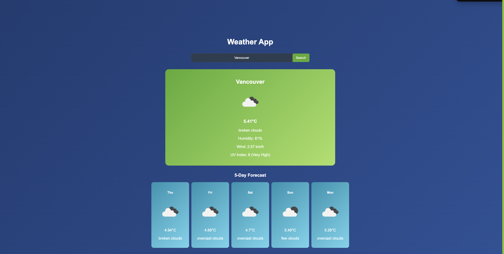
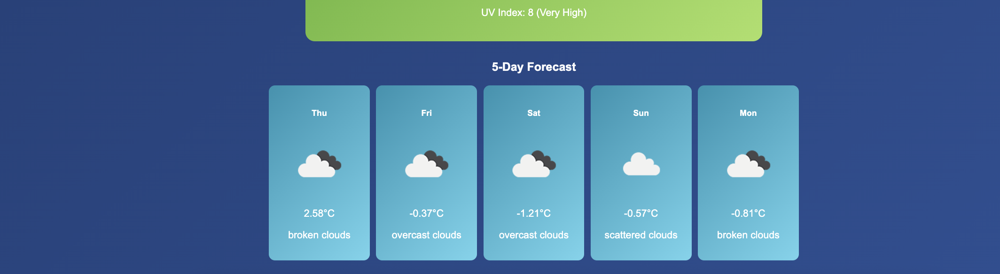

# **Weather App**

A responsive weather application built with ReactJS that displays the current weather and a 5-day forecast for any city using the OpenWeatherMap API. The app features a multicolored theme with blue and green shades and includes a search button for fetching weather data.

---

## **Features**
- **Current Weather**: Displays the temperature, weather condition, humidity, wind speed, and UV index for the selected city.
- **5-Day Forecast**: Shows the forecast for the next 5 days, including temperature, weather condition, and icons.
- **Search Button**: Users can input a city name and fetch weather data only when clicking the search button.
- **Default City**: Toronto is displayed by default when the app loads.
- **Responsive Design**: Fully responsive layout that works on all devices.
- **Styled with Gradients**: Includes a multicolored theme with blue and green gradient shades for an elegant appearance.

---

## **Screenshots**

### Home Page (Default Toronto)

### Search 

### 5-Day Forecast

